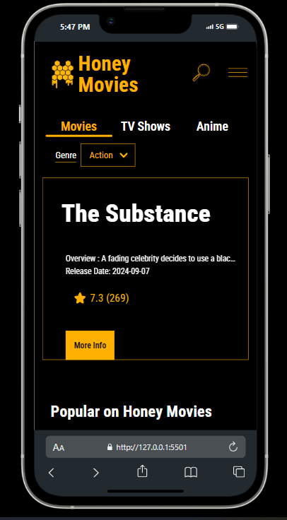
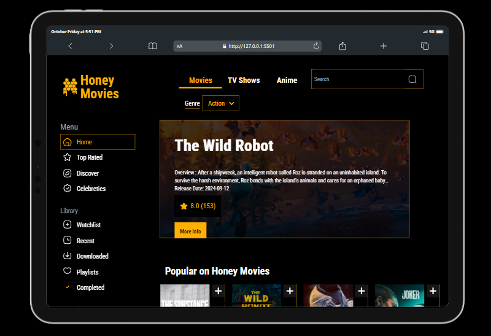

# Movies-on-the-go
This is project that enables a user get access to all movies available on the platform as well as watch them if desired at any time with an internet connection using TMDB's API. This project serves as a demonstration of JavaScript and basic Webpack bundling.

## Table Of Contents
- [Installation](#installation)
- [Usage](#usage)
- [Features](#features)
- [Technologies](#technologies)
- [Credits](#credits)

## Installation
To set up and run this project locally, follow these steps:
1. Clone the repository:
```bash
git clone https://github.com/devjhex/movies-on-the-go-javascript.git
```
2. Install dependencies
```bash
npm install
```
3. Bundle the files using webpack
```bash
npm run build
```
4. Open ```index.html``` in your browser to view the app.

## Usage
Once the project is set up, open ```index.html``` in your browser. The app will load a list of movies fetched from the TMDB API. You can use the search bar to look for specific movies.




## Features
- Fetches and displays movies from the TMDB API.
- Search for movies by title.
- Simple and clean UI for displaying movie details.

## Technologies
- JavaScript (Vanilla)
- HTML5 / CSS3
- Webpack
- TMDB API

## Credits
- [TMDB API](https://www.themoviedb.org/documentation/api) for providing movie data.
- Webpack for bundling the JavaScript.

## License
This project is licensed under the MIT License.

## Known Issues
- Movie Search and homepage may return limited results due to the TMDB API restrictions.
